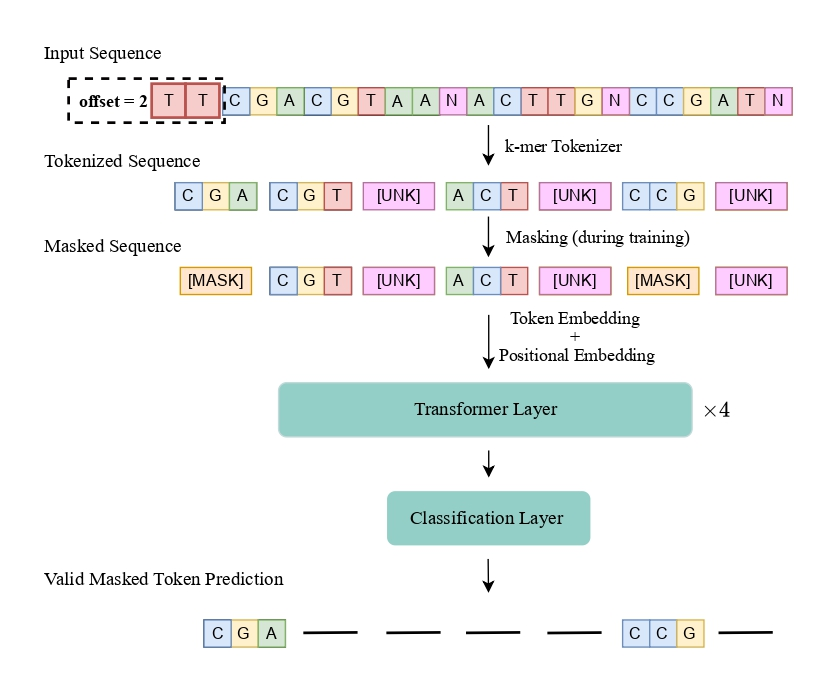

[](https://doi.org/10.5281/zenodo.15650124)

# BarcodeBERT

A pre-trained transformer model for inference on insect DNA barcoding data.  
<p align="center">
  
</p>

Read our paper in
[*Bioinformatics Advances*](https://doi.org/10.1093/bioadv/vbag054)
(Millan Arias et al., 2026).
If you use BarcodeBERT in your research,
please consider [citing us](#citation).

### Using the model

```python
from transformers import AutoTokenizer, AutoModel

# Load the tokenizer
tokenizer = AutoTokenizer.from_pretrained(
    "bioscan-ml/BarcodeBERT", trust_remote_code=True
)

# Load the model
model = AutoModel.from_pretrained("bioscan-ml/BarcodeBERT", trust_remote_code=True)

# Sample sequence
dna_seq = "ACGCGCTGACGCATCAGCATACGA"

# Tokenize
input_seq = tokenizer(dna_seq, return_tensors="pt")["input_ids"]

# Pass through the model
output = model(input_seq.unsqueeze(0))["hidden_states"][-1]

# Compute Global Average Pooling
features = output.mean(1)
```

### Reproducing the results from the paper

0. Clone this repository and install the required libraries.
The instructions below assume a working `pip`- or
[`uv`](https://docs.astral.sh/uv/)-managed Python environment.
Requires **Python 3.11 or 3.12**
(`torchtext`, a deprecated dependency,
does not provide wheels for 3.13+).
See [`pyproject.toml`](pyproject.toml) for the full list of
pinned dependencies.
```shell
pip install -e .
```
Or, using `uv`:
```shell
uv sync
```

1. Download the data from our Hugging Face Dataset [repository](https://huggingface.co/datasets/bioscan-ml/CanadianInvertebrates-ML)
```shell
cd data/
python download_HF_CanInv.py
```

**Optional**: You can also download the first version of the [data](https://vault.cs.uwaterloo.ca/s/x7gXQKnmRX3GAZm)
```shell
wget https://vault.cs.uwaterloo.ca/s/x7gXQKnmRX3GAZm/download -O data.zip
unzip data.zip
mv new_data/* data/
rm -r new_data
rm data.zip
```

2. DNA foundation model baselines: The desired backbone can be selected using one of the following keywords:  
`BarcodeBERT, NT, Hyena_DNA, DNABERT, DNABERT-2, DNABERT-S`
```bash
python baselines/knn_probing.py --backbone=<DESIRED-BACKBONE>  --data-dir=data/
python baselines/linear_probing.py --backbone=<DESIRED-BACKBONE>  --data-dir=data/
python baselines/finetuning.py --backbone=<DESIRED-BACKBONE> --data-dir=data/ --batch_size=32
python baselines/zsc.py --backbone=<DESIRED-BACKBONE>  --data-dir=data/
```
**Note**: The DNABERT model has to be downloaded manually following the instructions in the paper's [repo](https://github.com/jerryji1993/DNABERT) and placed in the `pretrained-models` folder.

3. Supervised CNN

```bash
 python baselines/cnn/1D_CNN_supervised.py
 python baselines/cnn/1D_CNN_KNN.py
 python baselines/cnn/1D_CNN_Linear_probing.py
 python baselines/cnn/1D_CNN_ZSC.py

```
**Note**: Train the CNN backbone with `1D_CNN_supervised.py` before evaluating it on any downtream task.

4. BLAST
```shell
cd data/
python to_fasta.py --input_file=supervised_train.csv &&
python to_fasta.py --input_file=supervised_test.csv &&
python to_fasta.py --input_file=unseen.csv

makeblastdb -in supervised_train.fas -title train -dbtype nucl -out train.fas
blastn -query supervised_test.fas -db train.fas -out results_supervised_test.tsv -outfmt 6 -num_threads 16
blastn -query unseen.fas -db train.fas -out results_unseen.tsv -outfmt 6 -num_threads 16
```
### Pretrain BarcodeBERT
To pretrain the model you can run the following command:
```bash
python barcodebert/pretraining.py
    --dataset=CANADA-1.5M \
    --k_mer=4 \
    --n_layers=4 \
    --n_heads=4 \
    --data_dir=data/ \
    --checkpoint=model_checkpoints/CANADA-1.5M/4_4_4/checkpoint_pretraining.pt
```

## Contributing

If you'd like to contribute to BarcodeBERT,
please read our [Contributing Guidelines](CONTRIBUTING.md)
for information about setup, code style, and submission process.

## Citation

If you find BarcodeBERT useful in your research please consider citing:

```bibtex
@article{MillanArias2026BarcodeBERT,
  author={Millan Arias, Pablo and Sadjadi, Niousha and Safari, Monireh
    and Gong, ZeMing and Wang, Austin T and Haurum, Joakim Bruslund
    and Zarubiieva, Iuliia and Steinke, Dirk and Kari, Lila
    and Chang, Angel X and Lowe, Scott C and Taylor, Graham W},
  title={{BarcodeBERT}: Transformers for Biodiversity Analyses},
  journal={Bioinformatics Advances},
  pages={vbag054},
  year={2026},
  month = feb,
  doi={10.1093/bioadv/vbag054},
}
```
