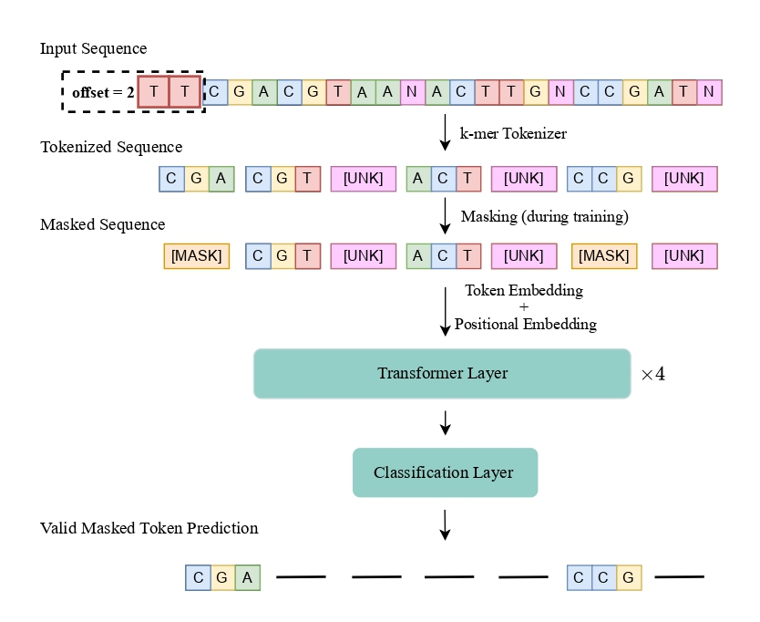

# BarcodeBERT

A pre-trained transformer model for inference on insect DNA barcoding data.  
<p align="center">
  
</p>

Check out our [paper](https://arxiv.org/abs/2311.02401)

### Using the model

```python
from transformers import AutoTokenizer, AutoModel

# Load the tokenizer
tokenizer = AutoTokenizer.from_pretrained(
    "bioscan-ml/BarcodeBERT", trust_remote_code=True
)

# Load the model
model = AutoModel.from_pretrained("bioscan-ml/BarcodeBERT", trust_remote_code=True)

# Sample sequence
dna_seq = "ACGCGCTGACGCATCAGCATACGA"

# Tokenize
input_seq = tokenizer(dna_seq, return_tensors="pt")["input_ids"]

# Pass through the model
output = model(input_seq.unsqueeze(0))["hidden_states"][-1]

# Compute Global Average Pooling
features = output.mean(1)
```

### Reproducing the results from the paper

0. Clone this repository and install the required libraries by running
```shell
pip install -e .
```

1. Download the data from our Hugging Face Dataset [repository](https://huggingface.co/datasets/bioscan-ml/CanadianInvertebrates-ML)
```shell
cd data/
python download_HF_CanInv.py
```

**Optional**: You can also download the first version of the [data](https://vault.cs.uwaterloo.ca/s/x7gXQKnmRX3GAZm)
```shell
wget https://vault.cs.uwaterloo.ca/s/x7gXQKnmRX3GAZm/download -O data.zip
unzip data.zip
mv new_data/* data/
rm -r new_data
rm data.zip
```

4. DNA foundation model baselines: The desired backbone can be selected using one of the following keywords:  
`BarcodeBERT, NT, Hyena_DNA, DNABERT, DNABERT-2, DNABERT-S`
```bash
python baselines/knn_probing.py --backbone=<DESIRED-BACKBONE>  --data-dir=data/
python baselines/linear_probing.py --backbone=<DESIRED-BACKBONE>  --data-dir=data/
python baselines/finetuning.py --backbone=<DESIRED-BACKBONE> --data-dir=data/ --batch_size=32
python baselines/zsc.py --backbone=<DESIRED-BACKBONE>  --data-dir=data/
```
**Note**: The DNABERT model has to be downloaded manually following the instructions in the paper's [repo](https://github.com/jerryji1993/DNABERT) and placed in the `pretrained-models` folder.

4.Supervised CNN

```bash
 python baselines/cnn/1D_CNN_supervised.py
 python baselines/cnn/1D_CNN_KNN.py
 python baselines/cnn/1D_CNN_Linear_probing.py
 python baselines/cnn/1D_CNN_ZSC.py

```
**Note**: Train the CNN backbone with `1D_CNN_supervised.py` before evaluating it on any downtream task.

5. BLAST
```shell
cd data/
python to_fasta.py --input_file=supervised_train.csv &&
python to_fasta.py --input_file=supervised_test.csv &&
python to_fasta.py --input_file=unseen.csv

makeblastdb -in supervised_train.fas -title train -dbtype nucl -out train.fas
blastn -query supervised_test.fas -db train.fas -out results_supervised_test.tsv -outfmt 6 -num_threads 16
blastn -query unseen.fas -db train.fas -out results_unseen.tsv -outfmt 6 -num_threads 16
```
### Pretrain BarcodeBERT
To pretrain the model you can run the following command:
```bash
python barcodebert/pretraining.py
    --dataset=CANADA-1.5M \
    --k_mer=4 \
    --n_layers=4 \
    --n_heads=4 \
    --data_dir=data/ \
    --checkpoint=model_checkpoints/CANADA-1.5M/4_4_4/checkpoint_pretraining.pt
```

## Citation

If you find BarcodeBERT useful in your research please consider citing:

```bibtex
@article{arias2023barcodebert,
  title={{BarcodeBERT}: Transformers for Biodiversity Analysis},
  author={Pablo Millan Arias
    and Niousha Sadjadi
    and Monireh Safari
    and ZeMing Gong
    and Austin T. Wang
    and Joakim Bruslund Haurum
    and Iuliia Zarubiieva
    and Dirk Steinke
    and Lila Kari
    and Angel X. Chang
    and Scott C. Lowe
    and Graham W. Taylor
  },
  journal={arXiv preprint arXiv:2311.02401},
  year={2023},
  eprint={2311.02401},
  archivePrefix={arXiv},
  primaryClass={cs.LG},
  doi={10.48550/arxiv.2311.02401},
}
```
